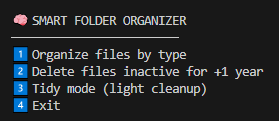

**Smart Folder Organizer (Python)**

Smart Folder Organizer is a safe, extensible, and interactive Python tool designed to analyze, organize, and clean folders in a controlled way.

It is built to behave like a real-world utility, while remaining easy to understand and modify.

**The project is:**

- Clean and readable

- Reusable and modular

- Idempotent (can be executed multiple times safely)

- Interactive and user-aware

**Features**
- Preview & Analysis Mode

- Before performing any action, the script analyzes the selected folder and displays a preview including:

- File count by type

- Number of existing folders

- Unknown or unsupported file types

- Files inactive for more than one year

- The oldest file detected

- No changes are made until the user explicitly confirms.

**Menu Options Explained**

When running the script, the following interactive menu is shown:

1. Organize files by type

    This option organizes files based on their extensions.

What it does:

* Groups files into folders such as PDF, Word, Images, Video, etc.

* Creates only the folders that are actually needed

* Sends unsupported or unknown file types to Others/

* Moves pre-existing folders into a single Folders/ directory

2. Delete files inactive for +1 year

    This option helps clean up unused files based on inactivity.

What it does:

* Scans files that have not been modified in over one year

* Displays a preview list of all detected inactive files

**Important:**

- Nothing is deleted automatically

- This action is irreversible

- Only folders with existing files are created

- No empty or unnecessary folders are generated

3. Tidy mode (light cleanup)

    This is a non-destructive cleanup mode focused on file naming consistency.

What it does:

- Renames files to a clean, standardized format

- Converts names to lowercase

- Replaces spaces with underscores

- Removes duplicated or messy characters

4. Exit

- Closes the program without performing any action.

**Folder Structure Example**
After organizing, the folder may look like this:

    SOURCE_FOLDER
    ├── PDF
    ├── Word
    ├── Excel
    ├── Images
    ├── Video
    ├── Others
    └── Folders
        ├── OldFolder1
        └── OldFolder2

**Notes:**

- Set the path of the folder you want to organize: SOURCE_FOLDER = r"PATH_TO_YOUR_FOLDER"

- Use an absolute path

- On Windows, use a raw string (r"")

# Examples:

* Windows

SOURCE_FOLDER = r"C:\Users\YourUser\Documents\MyFolder"

* macOS / Linux

SOURCE_FOLDER = "/Users/youruser/Documents/MyFolder"

File Type Rules
FOLDER_RULES = {
    "PDF": [".pdf"],
    "Word": [".doc", ".docx"],
    "Excel": [".xls", ".xlsx", ".csv"],
    "PowerPoint": [".ppt", ".pptx"],
    "Text": [".txt", ".md"],
    "Images": [".jpg", ".jpeg", ".png", ".gif", ".webp"],
    "Audio": [".mp3", ".wav", ".m4a"],
    "Video": [".mp4", ".mov", ".avi", ".mkv"],
    "Python": [".py"],
}

**How to Run?**

1. Make sure you have Python 3.9 or newer installed.

2. From the project directory run: main.py

3. Follow the interactive menu.